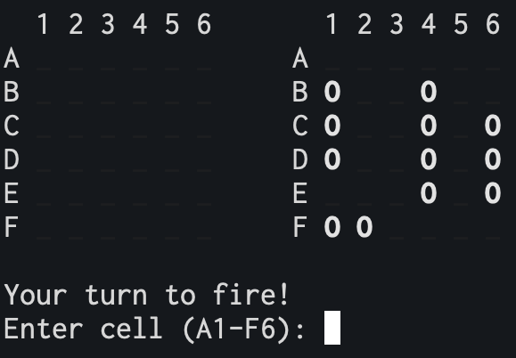
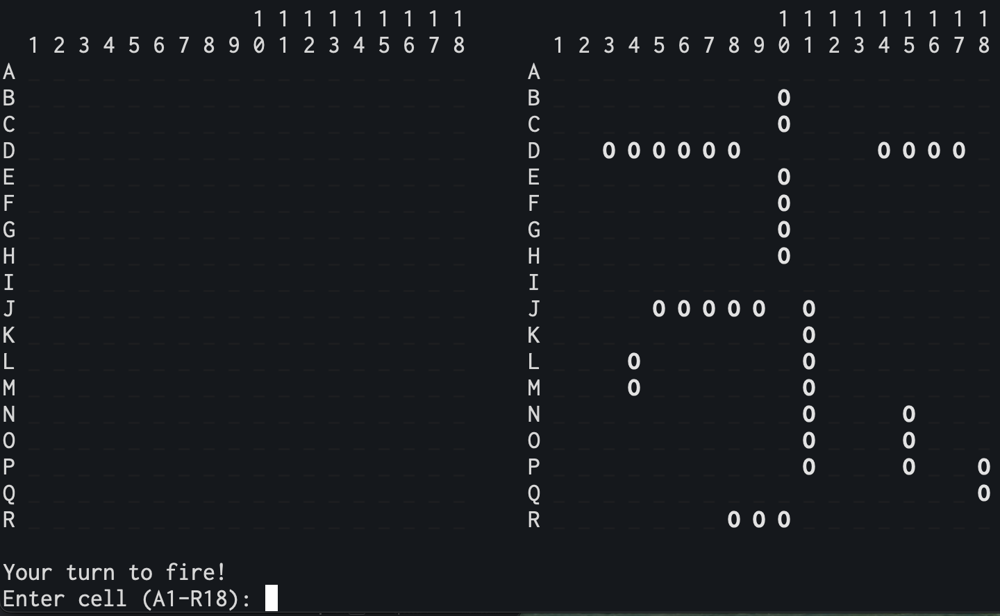
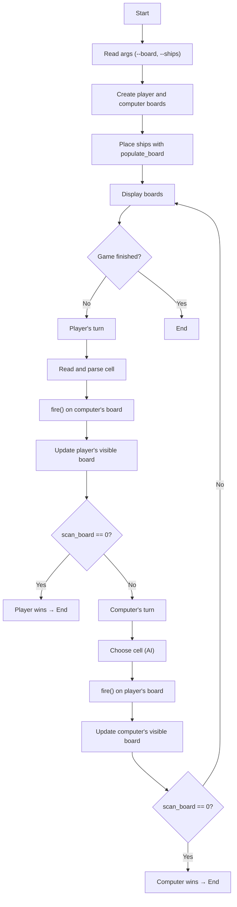
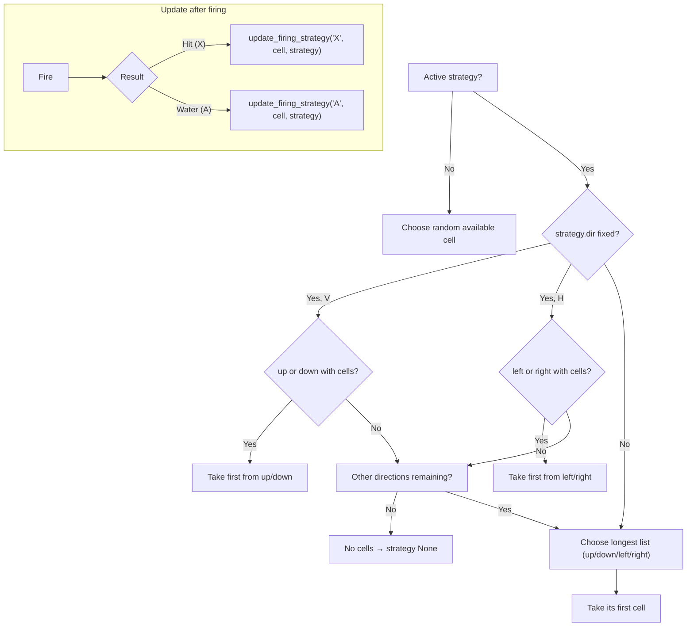

<p align='center'>
    
</p>
<!-- Title -->
<h1 align='center'> Battleship </h1>


<!-- tag line -->
<h3 align='center'> Basic Python implementation of the classic game </h3>

<!-- tech stack badges ---------------------------------- -->
<p align='center'>
    <!-- Python -->
    <a href="https://www.python.org"></a>
    <!-- NumPy -->
    <a href="https://numpy.org"></a>
    <!-- Rich -->
    <a href="https://rich.readthedocs.io"></a>
    <!-- uv -->
    <a href="https://docs.astral.sh/uv/"></a>
    <!-- Ruff -->
    <a href="https://docs.astral.sh/ruff/"></a>
</p>
<br/>

## Introduction
A console recreation of the classic **Battleship** game, designed for Python students. The project is split into two modules: `main.py` (game loop and orchestration) and `utils.py` (board logic, firing, and computer strategy).

## Demo

<p align='center'>
    
    <br/>
    <em>Watch the AI play against itself in demo mode</em>
</p>

> **Note:** The demo mode (computer vs computer) was inspired by the 1983 film [WarGames](https://www.imdb.com/title/tt0086567/), where the only winning move is not to play.

<details>
<summary>More board size examples</summary>

<p align='center'>
    
    <br/>
    <em>Compact 6×6 board with 4 ships</em>
</p>

<p align='center'>
    
    <br/>
    <em>Large 18×18 board with 10 ships</em>
</p>

</details>

## Requirements
- [Python 3.11.9](https://www.python.org) must be installed.


## How to Run

```bash
# Play against the computer (interactive mode)
uv run ./src/main.py play --board 10 --ships 4 3 3 2 2 2

# Watch the computer play against itself (demo mode)
uv run ./src/main.py demo --board 10 --ships 4 3 3 2 2 2

# Parameters:
# --board N          -> board size (N x N), default 10
# --ships l1 l2 ...  -> list of ship lengths, default 4 3 3 2 2 2
```

During the game, enter cells such as `F6`, `a 10`, `C-3`, etc. Type `quit` to exit.

---

## Board Representation

The board is a `numpy.ndarray` of size `N x N` whose values are characters:

- `'_'` → unfired water
- `'O'` → part of a ship
- `'X'` → hit (ship struck)
- `'A'` → agua/water (miss, already fired)

**Creation:** `setup_board(size)` returns a matrix filled with `'_'`.

---

## Ship Placement (no overflow, no overlap, no "touching")

1. **`populate_board(board, ship_lengths)`** iterates through the list of lengths and calls `place_ship`.
2. **`place_ship(length, board)`** randomly chooses **origin** and **orientation** (`H`/`V`) and validates with `it_fits`.
3. **`it_fits(length, origin, orientation, board)`** performs two checks:
   - **Fits on the board**: doesn't overflow the edge (checks final cell horizontally/vertically).
   - **Doesn't overlap or touch**: defines an **expanded rectangle** around the ship (one cell margin in all directions) and requires it to be free of `'O'`. Uses `rect_has_ship`.
4. If everything is valid, `place_ship` writes `'O'` in the ship's cells.

**Key idea:** the 1-cell "cushion" around ensures ships are not adjacent horizontally, vertically, or diagonally (thanks to the expanded rectangle).

---

## Firing

- **User input**: `parse_cell(cell, size)` converts formats like `F6`, `f 6`, `f-6` to zero-based `(row, column)` indices and validates boundaries.
- **Firing action**: `fire((r, c), board)`
  - If the cell is `'O'` → marks `'X'` and returns `True` (hit).
  - If the cell is `'_'` → marks `'A'` and returns `False` (miss).
  - If already `'X'` or `'A'` → returns `None` (repeated).
- **End state**: `scan_board(board)` returns how many `'O'` remain; if `0`, no ships remain on that board.

---

## Main Game Loop (summary)

1. Read parameters, create **two real boards** (player and computer) and **two visibility boards** (what each opponent sees of the other).
2. **Place** ships on both real boards.
3. Repeat turns:
   - **Player's turn**: read cell → `fire` on computer's board → update player's visible board → victory?
   - **Computer's turn**: choose cell (see AI) → `fire` on player's board → update computer's visible board → victory?

### Flow Diagram — Main Loop



---

## Computer Strategy (AI)

The AI alternates between **free mode** and **focus mode**:

- **Free mode**: if there are no recent hits to "follow up", it chooses an available cell at random with `random_cell_from_board` (can be improved with a parity pattern).
- **Focus mode**: after a **hit**, it builds a fan of cells **in straight lines** from the hit point in the four cardinal directions, **only through `'_'` cells**. Then:
  - Fixes the **direction** (H or V) as soon as it chains a second hit.
  - Continues firing along that line until exhausting the list or missing.
  - If a direction "dies" (water), it discards it.
  - If all are exhausted, returns to free mode.

<p align='center'>
    
    <br/>
    <em>Computer firing strategy in action: free mode → focus mode → directional pursuit</em>
</p>

**Key functions:**
- `initial_firing_strategy((r, c), board)` → creates the `up/down/left/right` lists and `dir=''`.
- `update_firing_strategy(shot, (r,c), strategy)` → updates lists and fixes `dir` when appropriate.
- `next_cell_from_strategy(strategy)` → decides the next cell (prioritises fixed direction; if none, takes from longest list).
- `longest_list_key(strategy)` → helps choose the direction with most "free space".

### Flow Diagram — AI (cell selection)



---

## Code Map

```
.
├── main.py
│   └─ Reads arguments, creates boards, places ships, turn loop,
│      displays boards and decides victory/defeat. Interacts with AI.
└── utils.py
    ├─ Board: setup_board, display_boards, clear
    ├─ Ship placement: populate_board, place_ship, it_fits, rect_has_ship
    ├─ Firing/state: parse_cell, fire, scan_board, random_cell_from_board
    └─ AI: initial_firing_strategy, update_firing_strategy,
           next_cell_from_strategy, longest_list_key
```

---

## Ideas for Practice/Improvement

- Use parity (chequered pattern) for **free mode** to reduce wasteful shots with long ships.
- Add **sunk ship** detection to reset or maintain strategies more intelligently.
- Write **unit tests** for:
  - `it_fits` and `rect_has_ship` (edges and adjacencies).
  - `parse_cell` (valid/invalid inputs).
  - `update_firing_strategy` and `next_cell_from_strategy` (logic branches).
- Support custom board sizes and ship lists from the CLI.

---

## Licence

This project is licensed under the MIT Licence - see the [LICENSE](LICENSE) file for details.

Educational use encouraged. Freely adapt it to practise Python and data structures.